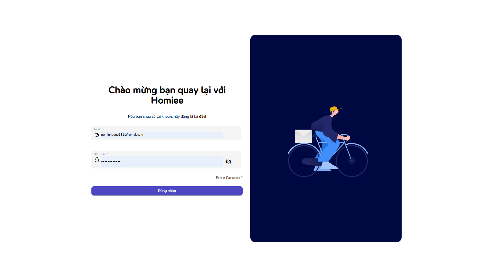

# Homie - INN Findor System - End user Web

An INN Findor System End-user Web created by PBL6 Team

Initially generated by the [Angular CLI](https://angular.io/cli) 🤖

## Features 🔥

- Authentication, select role, submit register email.
- Role Permission.
- Create, View, Delete, Edit, Search, Filter, Uptop Rental post.
- Review post, create booking to view rental house.
- Review evaluation analysis.
- User management.
- User post management.
- Booking management.
- Bookmark management.
- Statistics.
- Payment management (VNPAY).
- Notifications.

## Technologies/Libraries used 💪

- [Angular](https://angular.io/) Web Framework
- RxJs.
- [Material Angular](https://material.angular.io/)
- [Chart.js](https://www.chartjs.org/)

## Design System/UI-UX ️🎨

- [Material Design 2](https://material.io/)

## Environment 🚀

### Development server

Run `ng serve` for a dev server. Navigate to `http://localhost:4300/`. The application will automatically reload if you
change any of the source files.

### Code scaffolding

Run `ng generate component component-name` to generate a new component. You can also
use `ng generate directive|pipe|service|class|guard|interface|enum|module`.

### Build

Run `ng build` to build the project. The build artifacts will be stored in the `dist/` directory.

## Screenshots 📷

| Home Page                                                                                                                 | Sign In                                                                                                                 |
| ------------------------------------------------------------------------------------------------------------------------- | ----------------------------------------------------------------------------------------------------------------------- |
|              |                    |
| Select Role                                                                                                               | Register                                                                                                                |
|          |              |
| Detail Post                                                                                                               | Detail Review                                                                                                           |
|          |    |
| Detail Host                                                                                                               | User Posts                                                                                                              |
|          |            |
| Create Booking                                                                                                            | Booking List                                                                                                            |
|    |                |
| Create Review                                                                                                             | Create Booking                                                                                                          |
|      |  |
| Booking List                                                                                                              | Stat                                                                                                                    |
|                  |                      |
| Detail Booking                                                                                                            | Create Post                                                                                                             |
|    |        |
| Edit Post                                                                                                                 | Bookmarks                                                                                                               |
|              |              |
| Payment History                                                                                                           | Notification                                                                                                            |
|  |    |

## Deployment 🤖

## Contributor 🌟

<table>
  <tr>
    <td align="center"> <b>Phuong Tran</b><a href="https://github.com/hovanvydut/pbl6-frontend-client/commits?author=pphuongdut" title="Frontend Dev">💻</a> </td> 
    <td align="center"> <b>Truong Minh Phuoc</b><a href="https://github.com/hovanvydut/pbl6-frontend-client/commits?author=phuocleoceo" title="Frontend Dev">💻</a> </td> 
    <td align="center"> <b>Ho Van Vy</b><a href="https://github.com/hovanvydut/pbl6-frontend-client/commits?author=hovanvydut" title="Devops">🛠</a></td> 
</tr>
</table>
